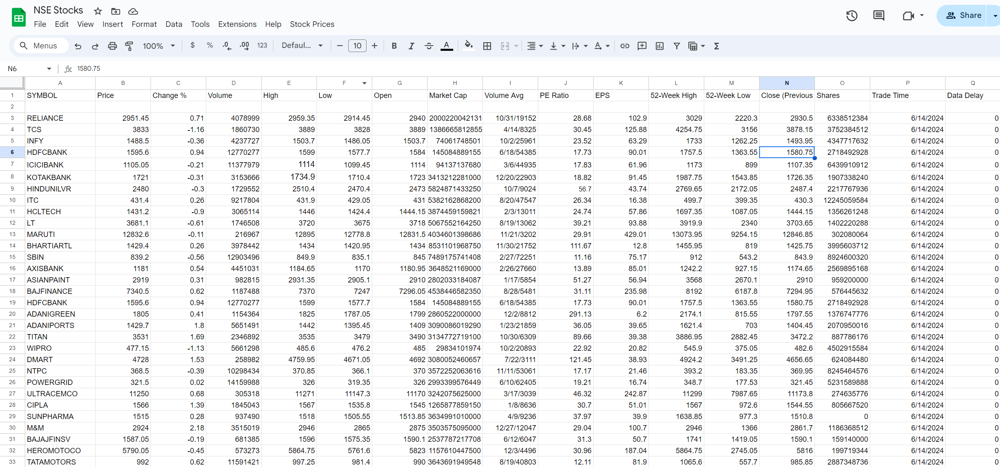

# NSE Stock Prices Automation

This Google Sheets script fetches real-time stock prices, changes percentage, volume, high, low, open prices, market capitalization, average daily trading volume, P/E ratio, earnings per share, 52-week high, 52-week low, previous day's closing prices, number of outstanding shares, trade time, and data delay for NSE stocks using the `GOOGLEFINANCE` function. Simply enter the stock symbols without the `NSE:` prefix, and the script will handle the rest.

## Features

- Fetches real-time stock prices for NSE listed stocks.
- Retrieves additional stock data such as:
  - Price
  - Percentage Change
  - Volume
  - High
  - Low
  - Open
  - Market Capitalization
  - Average Daily Trading Volume
  - P/E Ratio
  - Earnings Per Share
  - 52-Week High
  - 52-Week Low
  - Previous Day's Closing Price
  - Number of Outstanding Shares
  - Trade Time
  - Data Delay
- Automatically appends `NSE:` to stock symbols.

## Video Tutorial

For a detailed video tutorial on how to use the script, [click here](https://drive.google.com/file/d/1IUSCFHQpC6hRwfGvGHgsxXfry0T5IXRh/view?usp=sharing).

## Setup

1. Open your Google Sheets document.
2. Go to `Extensions` > `Apps Script`.
3. In the Apps Script editor, delete any existing code and replace it with the code from the `Code.js` file in this repository. *(Note: This file is named `Code.js` because GitHub does not support the `.gs` file extension used by Google Apps Script. However, you can copy the contents directly into your Apps Script project.)*
    - Copy the entire content of the `Code.js` file.
    - Paste the copied content into the Apps Script editor.
    - **Note**: If there are any specific lines you do not want to include, you can comment them out by adding `//` at the beginning of the line.
4. Save the script by clicking the disk icon or pressing `Ctrl + S`.
5. Close the Apps Script editor and refresh your Google Sheets document.
6. Enter stock symbols (without `NSE:`) starting from cell A3.
7. Click on `Stock Prices` > `Update Prices` to fetch and display stock data.

## Optional: Populate Stock Symbols Automatically

Instead of manually entering stock symbols, you can use the `Populate.js` script to add a predefined list of stocks.

### Steps to Use Populate.js

1. Open your Google Sheets document.
2. Go to `Extensions` > `Apps Script`.
3. In the Apps Script editor, delete any existing code and replace it with the code from the `Populate.js` file in this repository. *(Note: This file is named `Populate.js` because GitHub does not support the `.gs` file extension used by Google Apps Script. However, you can copy the contents directly into your Apps Script project.)*
    - Copy the entire content of the `Populate.js` file.
    - Paste the copied content into the Apps Script editor.
4. Save the script by clicking the disk icon or pressing `Ctrl + S`.
5. Close the Apps Script editor and refresh your Google Sheets document.
6. In Google Sheets, go to `Extensions` > `Apps Script` > `populateStocks` and run the function.
7. The predefined list of NSE stocks will be automatically populated starting from cell A3.

## License

This project is licensed under the [MIT License](LICENSE).